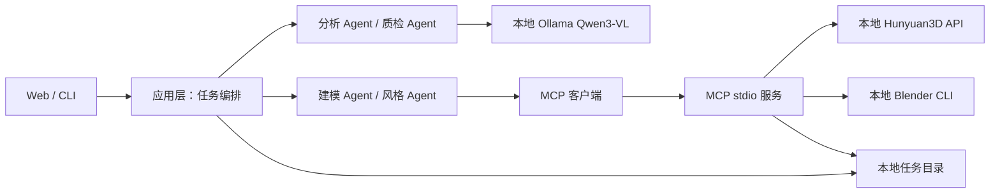

# MVP 设计文档

版本：0.1，2026-09-23。

## 系统边界

四个 Agent 有固定责任和显式交接物：分析者给 `subject`、`palette`；建模者给 GLB；风格者给 PNG；质检者给 `score`、`summary`。编排器负责阶段顺序和失败状态，不把模型输出直接当可执行命令。MCP 客户端使用 Python SDK 的 stdio 协议调用本项目服务；外部 MCP 客户端也可发现两个工具。Skill 文件用 YAML frontmatter + Markdown 存放，运行时加载正文作为分析/质检的领域规则。

## 分层与依赖

| 层 | 模块 | 依赖方向 |
|---|---|---|
| 接口 | `api.py`, `cli.py`, `static/` | 只调用应用层 |
| 应用 | `workflow.py`, `agents.py`, `jobs.py` | 调用存储、Skill 和工具端口 |
| 领域 | `storage.py`, `skills.py` | 不依赖 Web 或外部服务 |
| 基础设施 | `ollama.py`, `mcp_client.py`, `mcp_server.py`, `hunyuan.py`, `blender.py` | 实现应用层所需能力 |

通过路径 + JSON 传递交接物。任务目录 `data/jobs/<uuid>/` 含 `input.png|jpg`、`model.glb`、`preview.png`、`job.json`。状态包括 `queued`、`analyzing`、`modeling`、`rendering`、`reviewing`、`completed`、`failed`。`agent_trace` 记录完成的专职 Agent。每次阶段变更原子写入 `job.json`。进程意外退出后的未终止任务会在启动时标记为失败，说明可重新提交。

## 接口契约

- `POST /api/jobs`：multipart 图片；返回 202、`id`、`status`。
- `GET /api/jobs/{id}`：返回任务状态、阶段、错误、分析和质检信息及成功产物 URL。
- `GET /api/jobs/{id}/model` 与 `/preview`：只在文件存在时提供下载/预览。
- `GET /health`：应用进程健康，不宣称模型健康。
- CLI：`python -m toonforge.cli run <image>` 和 `python -m toonforge.cli serve`。
- MCP `generate_mesh(image_path, output_path)`：受限于数据根目录；调用 `POST /generate`，参数 `image` base64、`texture: true`、`type: glb`，响应为 GLB 字节。
- MCP `render_toon(model_path, output_path)`：受限于数据根目录；启动 Blender 后台脚本，检查 PNG 产物。

## 本地模型与渲染

Ollama 调用 `/api/chat`，传 base64 图像，要求 JSON 输出，使用 `qwen3-vl:8b-instruct`。分析和质检通过不同 Skill 指令运行同一模型，节省内存。Hunyuan3D 2.1 由独立进程在 `127.0.0.1:8081` 提供 API。Blender 使用 Eevee、正交相机、分段明暗色阶和 Freestyle 轮廓线。保留 GLB 原始材质与色彩作为参考，输出独立 PNG；不对原 GLB 写回破坏性材质更改。

## 失败与恢复

- 无效图像立即返回 400；模型服务连接失败、MCP 出错、Blender 无法运行均写 `failed` 和当前阶段。
- MCP 工具验证输出路径在 `data/jobs` 内，且源文件真实存在；超时由调用端控制。
- 当前阶段不自动重试重推理，避免重复生成和资源耗尽。
- 任务文件是唯一持久状态，界面刷新可恢复查询；运行中断后保留已有产物以便排障。

## 测试与实机验收

单元和协议测试覆盖图像校验、Skill 加载、Ollama JSON 解析、Hunyuan HTTP 二进制响应、MCP 工具发现和调用、状态落盘。Windows 开发机无 Blender 与 DGX Spark，不声称真实模型效果通过；实机验收按 `User Guide.md` 执行并把证据写进 `docs/阶段记录.md`。

## 演进约束

稳定接口是任务 JSON 字段、MCP 工具签名和产物文件名。后续替换 3D 模型仅改基础设施适配器，不改 Web 和编排。新增字段采用可选字段，已有字段不改名；状态值只新增，不重定义。
